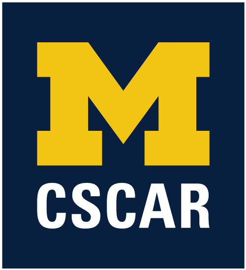

 
 
 

 

 
 
 

[CSCAR](http://cscar.research.umich.edu/)- Consulting for Statistics, Computation, & Analytics Research - is the consulting arm of the [Advanced Research Computing](http://arc.umich.edu/) group at the [University of Michigan](https://www.umich.edu/).  CSCAR provides consulting services and training opportunities in data science, statistics, and advanced research computation.  For more information about CSCAR visit the website.

This site is used for CSCAR resources, especially those geared toward helping collaborators and clients learn new tools for research.  It will house content primarily related to workshops, but also other things we might find useful to ourselves or our clients, and will be updated regularly.

